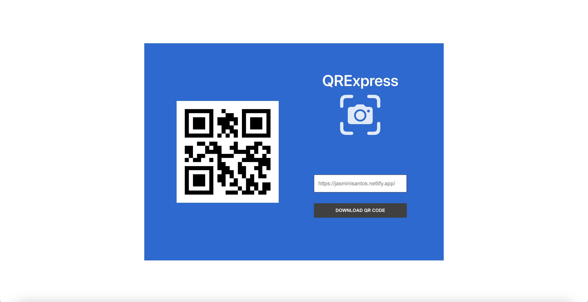
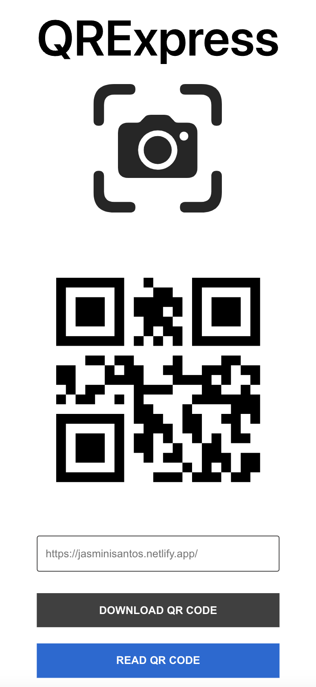

# QR Code Generator and Scanner

This project was bootstrapped with [Create React App](https://github.com/facebook/create-react-app).

## QR Code Generator
The QR Code Generator allows you to create a QR code for a given link. Simply enter the link and generate the QR code.

## QR Code Scanner
The QR Code Scanner feature enables you to scan QR codes using your device's camera. Upon scanning a QR code, the application will automatically redirect you to the corresponding link.

## Available Scripts
In the project directory, you can run:

### `npm start`
Runs the app in development mode.
Open http://localhost:3000 to view it in your browser.

The page will reload when you make changes.

### `npm test`
Launches the test runner in interactive watch mode.

### `npm run build`
Builds the app for production to the build folder.

### `npm install react`
A JavaScript library for building user interfaces.

### `npm install qrcode.react`
A QR code generator React component.

### `npm install validator`
A library for data validation.

### `npm install react-qr-reader`
A QR code scanner React component.

### `npm install react-icons`
A library for displaying icons in React components
